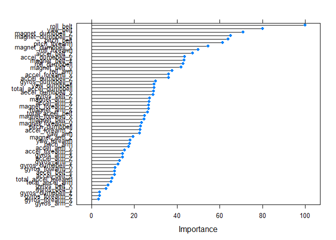

## Executive summary

In this project, the goal is to use data from accelerometers on the belt, forearm, arm, and dumbell of 6 participants. They were asked to perform barbell lifts correctly and incorrectly in 5 different ways. More information is available from the website here: http://web.archive.org/web/20161224072740/http:/groupware.les.inf.puc-rio.br/har (see the section on the Weight Lifting Exercise Dataset).

Several machine learning algorythms were used to choose a final model; cross-validation analysis showed that model produced by the random forest method was the most accurate.

## Loading data

The training data for this project are available here: https://d396qusza40orc.cloudfront.net/predmachlearn/pml-training.csv
The test data are available here: https://d396qusza40orc.cloudfront.net/predmachlearn/pml-testing.csv


```r
trdat = read.csv("pml-training.csv")
testdata = read.csv("pml-testing.csv")
```

First of all we'll separate a portion of data which will be used for cross validation


```r
library(caret)
set.seed(29)
inTrain = createDataPartition(trdat$classe, p = 3/4)[[1]]
training = trdat[inTrain,]
validation = trdat[-inTrain,]
```

## Exploratory analysis and cleaning


```r
dim(training)
```

```
## [1] 14718   160
```

The data has a lot of variables, so before fitting a model it makes sense to reduce their amount and leave only relevant ones. 

After performing some exploratory analysis (outputs are omitted due to significant size) we can drop columns a) with mostly NA value; b) with negligible variance (most probably not good predictors); c) informational fields, such as observation index, name, etc.

### Removing the columns with little known data

By changing the threshold below we can see that certain amount of columns have more than 95% of the values missing, whereas rest of the data is quite full. Setting the threshold to 90% just for very conservative removal.


```r
thres = 0.9
NAcols <- apply(training, 2,  FUN = function(x){sum(is.na(x)) > (nrow(training)*thres)})
NNAcols <- names(subset(NAcols, NAcols == F))
training <- training[NNAcols]
```

67 columns gone.

### Removing predictors with low variablility


```r
NZVcols <- nearZeroVar(training)
training <- training[-NZVcols]
```

### Removing informational fields


```r
training <- training[-c(1:6)]
```

### Tidying up

```r
dim(training)
```

```
## [1] 14718    53
```

Let's apply performed changes to our validation and test datasets for future comparison

```r
trvars <- names(training)
tstvars <- names(training[,-53])
validation <- validation [trvars]
testing <- testdata[tstvars]
```

## Finding a best-fit model

For the comparison 4 algorythms were chosen as quite popular for classification: decision tree, random forest, boosting and svm.

### Preparation for model fitting

```r
library(rpart) 
library(rpart.plot) 
library(rattle)
library(e1071)
```

Next chunk is setting the seed and preparing the machine for performing calculations more efficiently. (Thanks to the author of this article: https://rpubs.com/lgreski/improvingCaretPerformance code for modelling runs manageable amount of time)


```r
set.seed(29)
library(parallel)
library(doParallel)
cluster <- makeCluster(detectCores() - 1) # convention to leave 1 core for OS
registerDoParallel(cluster)

tc <- trainControl(method = "cv", number = 5, allowParallel=TRUE)
```

### Models

Code below fits the model using different methods and gets the running time for each.


```r
mrfst <- system.time (mrf <- train(classe ~., data = training, method = "rf", trControl= tc))
mgbmst <- system.time (mgbm <- train(classe ~., data = training, method = "gbm", verbose = FALSE, trControl= tc))
mrpst <- system.time (mrp <- train(classe ~., data = training, method = "rpart", trControl= tc))
msvmst <- system.time (msvm <- svm(classe ~ ., data = training, trControl= tc))
```

Shutting the cluster down

```r
stopCluster(cluster)
registerDoSEQ()
```

### Cross-validation
For the evaluation of the fitted models' efficiency we use our wisely prepared validation set and combine it into a table.


```r
prf <- predict(mrf, validation)
pgbm <- predict(mgbm, validation)
prp <- predict(mrp, validation)
psvm <- predict(msvm, validation)

comp1 <- c("random forest", confusionMatrix(prf, validation$classe)$overall[1], mrfst[2])
comp2 <- c("boosting", confusionMatrix(pgbm, validation$classe)$overall[1], mgbmst[2])
comp3 <- c("decision tree", confusionMatrix(prp, validation$classe)$overall[1], mrpst[2])
comp4 <- c("svm", confusionMatrix(psvm, validation$classe)$overall[1], msvmst[2])

library(knitr)
library(kableExtra)
library(dplyr)

comp <- data.frame(matrix(ncol = 3, nrow = 0))
comp <- rbind(comp, comp1, comp2, comp3, comp4)
x <- c("method", "accuracy", "running time")
colnames(comp) <- x

kable(comp) %>%
        kable_styling(bootstrap_options = c("striped", "hover"), 
                full_width = F)
```

<table class="table table-striped table-hover" style="width: auto !important; margin-left: auto; margin-right: auto;">
 <thead>
  <tr>
   <th style="text-align:left;"> method </th>
   <th style="text-align:left;"> accuracy </th>
   <th style="text-align:left;"> running time </th>
  </tr>
 </thead>
<tbody>
  <tr>
   <td style="text-align:left;"> random forest </td>
   <td style="text-align:left;"> 0.992862969004894 </td>
   <td style="text-align:left;"> 5.92 </td>
  </tr>
  <tr>
   <td style="text-align:left;"> boosting </td>
   <td style="text-align:left;"> 0.96594616639478 </td>
   <td style="text-align:left;"> 1.51 </td>
  </tr>
  <tr>
   <td style="text-align:left;"> decision tree </td>
   <td style="text-align:left;"> 0.498776508972268 </td>
   <td style="text-align:left;"> 0.0200000000000014 </td>
  </tr>
  <tr>
   <td style="text-align:left;"> svm </td>
   <td style="text-align:left;"> 0.954323001631321 </td>
   <td style="text-align:left;"> 0.109999999999999 </td>
  </tr>
</tbody>
</table>

## Conclusion

According to our test, random forest method did the best in terms of predicting values for the validation dataset with predicted out of sample error of 0.007137. Boosting came a close second with the OOS error of 0.0340538, but MUCH better performance. The other option would be to limit the predictor to the most important ones (see Appendix 1): even leaving only 5 most significant predictors still gives an estimated OOS error around 0.03 (see Appendix 2).
Since the end goal of this excercise is to predict values in test dataset (rather small) as accurate as possible, let's choose the model produced by the random forest method with all the variables as predictors as our final, but with the note that eliminating predictors is probably preferrable to use on large sets of data.

## Prediction


```r
predict(mrf, testing)
```

```
##  [1] B A B A A E D B A A B C B A E E A B B B
## Levels: A B C D E
```

******

# Appendix

## Appendix 1. Variable importance in the final model

```r
plot(varImp(mrf))
```

<!-- -->

## Appendix 2. Optimization

```r
set.seed(29)

cluster <- makeCluster(detectCores() - 1) # convention to leave 1 core for OS
registerDoParallel(cluster)

mrfstAdj <- system.time (mrfAdj <- train(classe ~ roll_belt + pitch_forearm + yaw_belt + magnet_dumbbell_z 
        + pitch_belt + magnet_dumbbell_y + roll_forearm + accel_dumbbell_y, 
        data = training, method = "rf", trControl= tc))

prfAdj <- predict(mrfAdj, validation)

comp5 <- c("random forest8", confusionMatrix(prfAdj, validation$classe)$overall[1], mrfstAdj[2])

mrfstAdj2 <- system.time (mrfAdj2 <- train(classe ~ roll_belt + pitch_forearm + yaw_belt + magnet_dumbbell_z + pitch_belt, 
        data = training, method = "rf", trControl= tc))

prfAdj2 <- predict(mrfAdj2, validation)

comp6 <- c("random forest5", confusionMatrix(prfAdj2, validation$classe)$overall[1],mrfstAdj2[2])

comp <- data.frame(matrix(ncol = 3, nrow = 0))
comp <- rbind(comp, comp1, comp2, comp3, comp4, comp5, comp6)
x <- c("method", "accuracy", "running time")
colnames(comp) <- x

kable(comp) %>%
        kable_styling(bootstrap_options = c("striped", "hover"), 
                full_width = F)
```

<table class="table table-striped table-hover" style="width: auto !important; margin-left: auto; margin-right: auto;">
 <thead>
  <tr>
   <th style="text-align:left;"> method </th>
   <th style="text-align:left;"> accuracy </th>
   <th style="text-align:left;"> running time </th>
  </tr>
 </thead>
<tbody>
  <tr>
   <td style="text-align:left;"> random forest </td>
   <td style="text-align:left;"> 0.992862969004894 </td>
   <td style="text-align:left;"> 5.92 </td>
  </tr>
  <tr>
   <td style="text-align:left;"> boosting </td>
   <td style="text-align:left;"> 0.96594616639478 </td>
   <td style="text-align:left;"> 1.51 </td>
  </tr>
  <tr>
   <td style="text-align:left;"> decision tree </td>
   <td style="text-align:left;"> 0.498776508972268 </td>
   <td style="text-align:left;"> 0.0200000000000014 </td>
  </tr>
  <tr>
   <td style="text-align:left;"> svm </td>
   <td style="text-align:left;"> 0.954323001631321 </td>
   <td style="text-align:left;"> 0.109999999999999 </td>
  </tr>
  <tr>
   <td style="text-align:left;"> random forest8 </td>
   <td style="text-align:left;"> 0.984298531810767 </td>
   <td style="text-align:left;"> 2.94 </td>
  </tr>
  <tr>
   <td style="text-align:left;"> random forest5 </td>
   <td style="text-align:left;"> 0.970432300163132 </td>
   <td style="text-align:left;"> 1.56 </td>
  </tr>
</tbody>
</table>

```r
stopCluster(cluster)
registerDoSEQ()
```

## Appendix 3. Environment data


```r
sessionInfo()
```

```
## R version 3.5.1 (2018-07-02)
## Platform: x86_64-w64-mingw32/x64 (64-bit)
## Running under: Windows 10 x64 (build 17134)
## 
## Matrix products: default
## 
## locale:
## [1] LC_COLLATE=English_United States.1252 
## [2] LC_CTYPE=English_United States.1252   
## [3] LC_MONETARY=English_United States.1252
## [4] LC_NUMERIC=C                          
## [5] LC_TIME=English_United States.1252    
## 
## attached base packages:
## [1] parallel  stats     graphics  grDevices utils     datasets  methods  
## [8] base     
## 
## other attached packages:
##  [1] dplyr_0.7.8       kableExtra_1.1.0  knitr_1.20       
##  [4] doParallel_1.0.14 iterators_1.0.10  foreach_1.4.4    
##  [7] e1071_1.7-1       rattle_5.2.0      rpart.plot_3.0.7 
## [10] rpart_4.1-13      caret_6.0-84      ggplot2_3.1.0    
## [13] lattice_0.20-38  
## 
## loaded via a namespace (and not attached):
##  [1] Rcpp_0.12.19        lubridate_1.7.4     class_7.3-14       
##  [4] assertthat_0.2.0    rprojroot_1.3-2     digest_0.6.18      
##  [7] ipred_0.9-9         R6_2.3.0            plyr_1.8.4         
## [10] backports_1.1.2     stats4_3.5.1        evaluate_0.12      
## [13] highr_0.7           httr_1.3.1          pillar_1.3.0       
## [16] rlang_0.3.0.1       lazyeval_0.2.1      rstudioapi_0.8     
## [19] data.table_1.11.8   Matrix_1.2-15       rmarkdown_1.10     
## [22] splines_3.5.1       webshot_0.5.1       gower_0.2.1        
## [25] readr_1.3.1         stringr_1.3.1       munsell_0.5.0      
## [28] compiler_3.5.1      pkgconfig_2.0.2     gbm_2.1.5          
## [31] htmltools_0.3.6     nnet_7.3-12         tidyselect_0.2.5   
## [34] tibble_1.4.2        gridExtra_2.3       prodlim_2018.04.18 
## [37] codetools_0.2-15    randomForest_4.6-14 viridisLite_0.3.0  
## [40] crayon_1.3.4        withr_2.1.2         MASS_7.3-51.1      
## [43] recipes_0.1.5       ModelMetrics_1.2.2  grid_3.5.1         
## [46] nlme_3.1-137        gtable_0.2.0        magrittr_1.5       
## [49] scales_1.0.0        stringi_1.2.4       reshape2_1.4.3     
## [52] bindrcpp_0.2.2      timeDate_3043.102   xml2_1.2.0         
## [55] generics_0.0.2      lava_1.6.5          tools_3.5.1        
## [58] glue_1.3.0          purrr_0.2.5         hms_0.4.2          
## [61] survival_2.43-1     yaml_2.2.0          colorspace_1.3-2   
## [64] rvest_0.3.2         bindr_0.1.1
```


